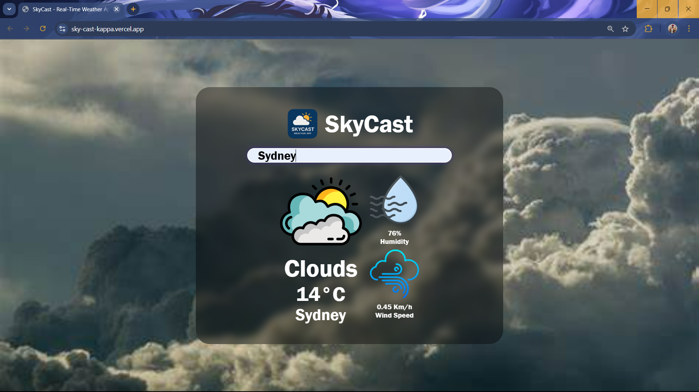

# 🌤️ SkyCast - Real-Time Weather App

SkyCast is a sleek and responsive web application that provides **real-time weather updates** for cities across the globe. Powered by modern JavaScript and a clean UI, SkyCast displays current temperature, weather conditions, humidity, and wind speed.

---

## 🌍 Live Demo

> 🚀 [Visit SkyCast Online](https://sky-cast-kappa.vercel.app/)  

---

## 📸 Screenshots

---

## ✨ Features

- 🔍 Search weather by city name
- 🌡️ Real-time temperature and condition updates
- 💧 Humidity and 💨 wind speed indicators
- 🧭 Responsive layout and intuitive interface
- ❌ Error message for invalid city names

---

## 🛠️ Technologies Used

- **HTML5**
- **CSS3**
- **JavaScript (Vanilla JS)**
- **OpenWeatherMap API** 
- **Hosting via Vercel**

---
